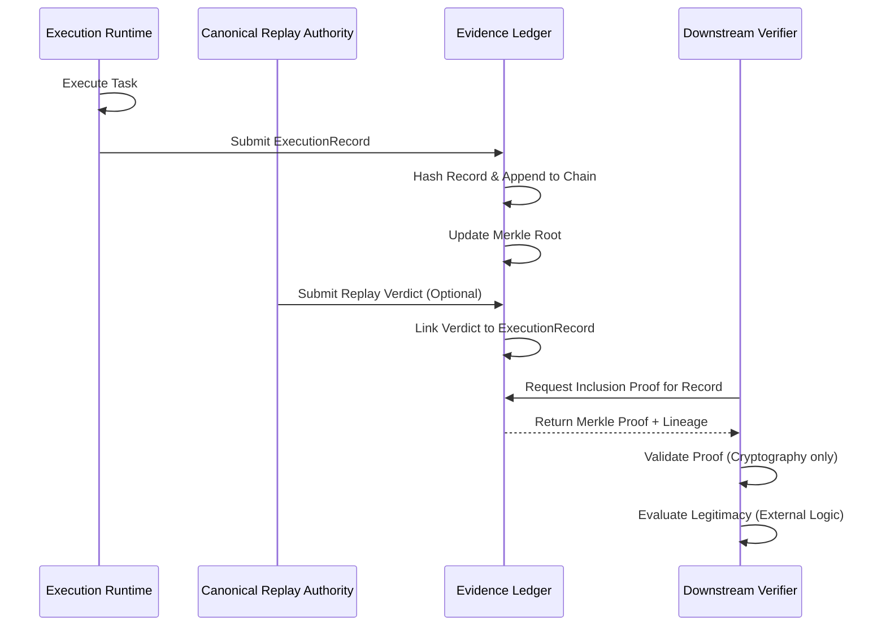

# Evidence Ledger Constitutional Doctrine

## Overview
This document establishes the constitutional doctrine for the Evidence Ledger within the BHIV ecosystem. It defines the strict boundaries of ownership and authority, separating the cryptographically verifiable *proof of execution* from the subjective *legitimacy of execution*.

## Layer Placement
The Evidence Ledger operates as foundational infrastructure within the BHIV ecosystem.

*   **Ecosystem Layer**: Trust & Provenance Infrastructure (Foundational)
*   **Upstream Systems (Producers)**:
    *   Execution Runtime (Produces `ExecutionRecord`)
    *   Canonical Replay Authority (Provides replay lineage)
*   **Downstream Systems (Consumers)**:
    *   Verification Services
    *   Governance Services (e.g., GC)
    *   Audit & Monitoring Systems
    *   Optimization Runtimes (e.g., Kanishk)

## Authority Boundaries

### Authority Owned (What it MAY do)
The Evidence Ledger is strictly a provenance and integrity engine. It **MAY**:
*   Store evidence
*   Chain evidence cryptographically
*   Generate merkle roots for state commitments
*   Generate inclusion proofs for specific records
*   Expose immutable evidence snapshots

### Authority Explicitly NOT Owned (What it MUST NOT do)
The Evidence Ledger is devoid of governance or authorization logic. It **MUST NOT**:
*   Authorize execution
*   Approve execution
*   Reject execution
*   Validate governance legitimacy
*   Create replay verdicts
*   Create constitutional truth

## Ownership Matrix

| Domain | Owner | Description |
| :--- | :--- | :--- |
| **Evidence Persistence** | Evidence Ledger | Immutable storage of execution artifacts. |
| **Integrity Proofs** | Evidence Ledger | Generation of Merkle roots and inclusion proofs. |
| **Execution Lineage** | Evidence Ledger | Cryptographic chaining of sequential records. |
| **Execution Policy** | External (GC) | Determination of what is allowed to run. |
| **Execution Logic** | External (Runtime) | The actual computation or action performed. |

## Authority Matrix

| Action | Has Authority? | Rationale |
| :--- | :--- | :--- |
| **Record Evidence** | Yes | Core capability; maintaining the immutable ledger. |
| **Prove Inclusion** | Yes | Core capability; providing verifiable trust. |
| **Evaluate Legitimacy**| No | Separation of concerns; legitimacy is subjective and external. |
| **Block Execution** | No | The ledger records history, it does not gatekeep actions. |

## Negative Authority Matrix

| External System | Action Attempted | Ledger Response |
| :--- | :--- | :--- |
| **Governance System** | "Delete this record, it was unauthorized." | **Reject**. The ledger is append-only and immutable. |
| **Execution Runtime** | "Did this execution violate policy?" | **Reject**. The ledger holds no policy context. |
| **Replay Authority** | "Is this verdict correct?" | **Reject**. The ledger only proves the verdict *exists*, not its correctness. |

## Lifecycle Diagram

## Runtime Example

1.  **Action**: The Optimization Runtime (Kanishk) submits a state change request to the Execution Runtime.
2.  **Execution**: The Execution Runtime performs the operation and generates an `ExecutionRecord`.
3.  **Recording**: The `ExecutionRecord` is sent to the Evidence Ledger.
4.  **Ledger Processing**: The Evidence Ledger calculates the cryptographic hash of the record, links it to the previous record's hash (chaining), and updates the system's Merkle tree.
5.  **Proof Generation**: The Evidence Ledger generates a `certificate` containing the record, its lineage reference, and the Merkle inclusion proof.
6.  **Verification**: A downstream audit service requests the certificate. It independently verifies the Merkle proof against the known root and verifies the lineage hashes. It *then* consults the Governance System (GC) to determine if the execution was legitimate according to current policy. The Evidence Ledger provided the *proof* of what happened, while GC provided the *verdict* on its legitimacy.
