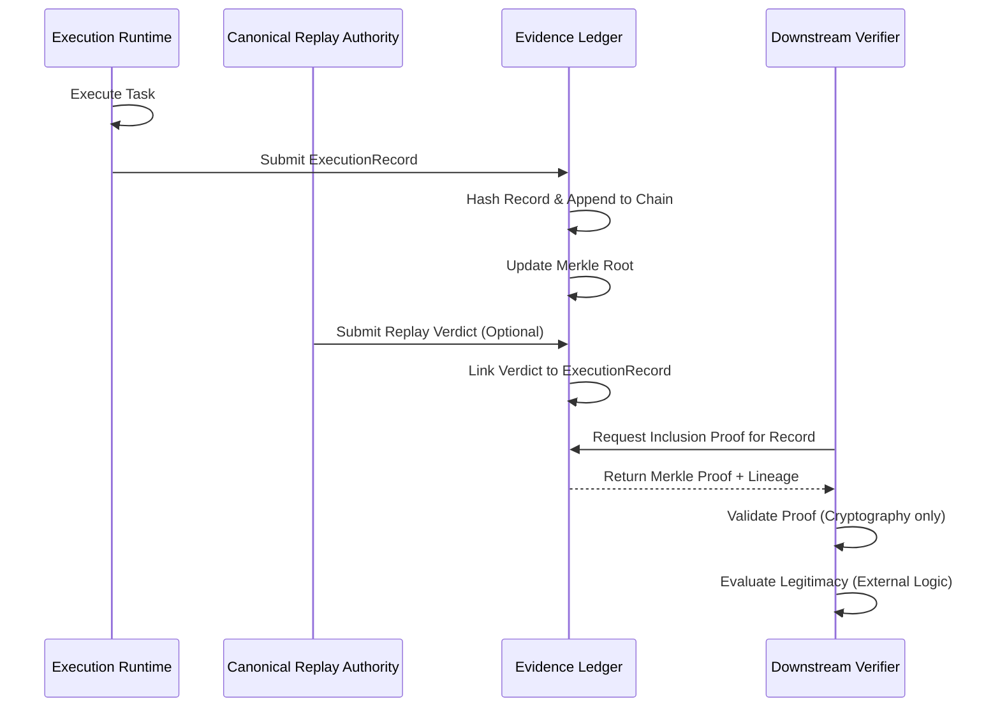
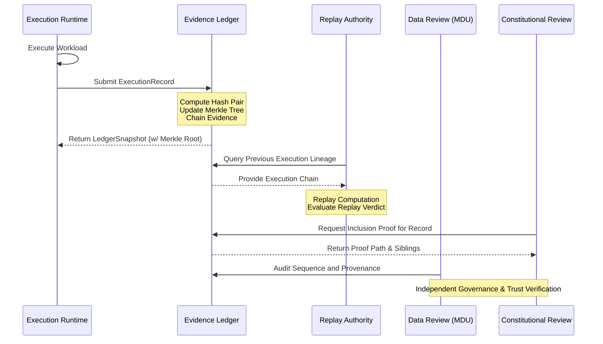

# Evidence Ledger Constitutional Doctrine

<<<<<<< HEAD
## Overview
This document establishes the constitutional doctrine for the Evidence Ledger within the BHIV ecosystem. It defines the strict boundaries of ownership and authority, separating the cryptographically verifiable *proof of execution* from the subjective *legitimacy of execution*.

## Layer Placement
The Evidence Ledger operates as foundational infrastructure within the BHIV ecosystem.

*   **Ecosystem Layer**: Trust & Provenance Infrastructure (Foundational)
*   **Upstream Systems (Producers)**:
    *   Execution Runtime (Produces `ExecutionRecord`)
    *   Canonical Replay Authority (Provides replay lineage)
*   **Downstream Systems (Consumers)**:
    *   Verification Services
    *   Governance Services (e.g., GC)
    *   Audit & Monitoring Systems
    *   Optimization Runtimes (e.g., Kanishk)

## Authority Boundaries

### Authority Owned (What it MAY do)
The Evidence Ledger is strictly a provenance and integrity engine. It **MAY**:
*   Store evidence
*   Chain evidence cryptographically
*   Generate merkle roots for state commitments
*   Generate inclusion proofs for specific records
*   Expose immutable evidence snapshots

### Authority Explicitly NOT Owned (What it MUST NOT do)
The Evidence Ledger is devoid of governance or authorization logic. It **MUST NOT**:
*   Authorize execution
*   Approve execution
*   Reject execution
*   Validate governance legitimacy
*   Create replay verdicts
*   Create constitutional truth

## Ownership Matrix

| Domain | Owner | Description |
| :--- | :--- | :--- |
| **Evidence Persistence** | Evidence Ledger | Immutable storage of execution artifacts. |
| **Integrity Proofs** | Evidence Ledger | Generation of Merkle roots and inclusion proofs. |
| **Execution Lineage** | Evidence Ledger | Cryptographic chaining of sequential records. |
| **Execution Policy** | External (GC) | Determination of what is allowed to run. |
| **Execution Logic** | External (Runtime) | The actual computation or action performed. |

## Authority Matrix

| Action | Has Authority? | Rationale |
| :--- | :--- | :--- |
| **Record Evidence** | Yes | Core capability; maintaining the immutable ledger. |
| **Prove Inclusion** | Yes | Core capability; providing verifiable trust. |
| **Evaluate Legitimacy**| No | Separation of concerns; legitimacy is subjective and external. |
| **Block Execution** | No | The ledger records history, it does not gatekeep actions. |

## Negative Authority Matrix

| External System | Action Attempted | Ledger Response |
| :--- | :--- | :--- |
| **Governance System** | "Delete this record, it was unauthorized." | **Reject**. The ledger is append-only and immutable. |
| **Execution Runtime** | "Did this execution violate policy?" | **Reject**. The ledger holds no policy context. |
| **Replay Authority** | "Is this verdict correct?" | **Reject**. The ledger only proves the verdict *exists*, not its correctness. |

## Lifecycle Diagram

## Runtime Example

1.  **Action**: The Optimization Runtime (Kanishk) submits a state change request to the Execution Runtime.
2.  **Execution**: The Execution Runtime performs the operation and generates an `ExecutionRecord`.
3.  **Recording**: The `ExecutionRecord` is sent to the Evidence Ledger.
4.  **Ledger Processing**: The Evidence Ledger calculates the cryptographic hash of the record, links it to the previous record's hash (chaining), and updates the system's Merkle tree.
5.  **Proof Generation**: The Evidence Ledger generates a `certificate` containing the record, its lineage reference, and the Merkle inclusion proof.
6.  **Verification**: A downstream audit service requests the certificate. It independently verifies the Merkle proof against the known root and verifies the lineage hashes. It *then* consults the Governance System (GC) to determine if the execution was legitimate according to current policy. The Evidence Ledger provided the *proof* of what happened, while GC provided the *verdict* on its legitimacy.
=======
The Evidence Ledger is a foundational infrastructure component designed to provide a constitutionally bounded, replay-safe, and ecosystem-ready trust capability across BHIV systems. Its core purpose is to prove execution lineage and evidentiary integrity without enforcing governance or operational validity.

## 1. Authority Owned

The Evidence Ledger has strictly defined responsibilities. It **MAY**:
- **Store evidence**: Persist execution records securely.
- **Chain evidence**: Link execution records sequentially to create immutable lineage.
- **Generate Merkle roots**: Compute a unified State Hash (Merkle root) for a given point in time across the evidence tree.
- **Generate inclusion proofs**: Provide verifiable proofs that a specific piece of execution evidence exists within the ledger at a certain state.
- **Expose evidence snapshots**: Serve point-in-time reference states of the ledger back to ecosystem callers for cross-validation or verification.

## 2. Authority Explicitly NOT Owned

To preserve the separation of concerns and avoid entrenchment of validation systems, the Evidence Ledger **MUST NOT**:
- **Authorize execution**: The ledger cannot decide if an execution was permitted to run.
- **Approve execution**: The ledger cannot assert if an execution was correct or met operational guidelines.
- **Reject execution**: The ledger cannot block execution ingestion based on rule violations (unless the cryptographic chain itself is invalid).
- **Validate governance legitimacy**: The ledger is completely ignorant of whether the producer met the ecosystem's policy constitution (GC boundary).
- **Create replay verdicts**: Replay validation is the domain of the Replay Authority; the ledger only provides the lineage.
- **Create constitutional truth**: Evidence is solely a record of *what happened*, not *what should have happened*.

## 3. Layer Placement

The Evidence Ledger acts as the persistence and chaining bedrock of the overall Execution Evidence system.

* **Ecosystem Layer**: Transverse Data / Infrastructure (Positioned alongside TMS, but fully insulated from application-level business logic).
* **Upstream Systems**: 
  - **Execution Runtime**: Produces the ExecutionRecords during raw processing.
  - **Kanishk Optimization Runtime**: Can feed deterministic optimization executions as upstream evidence.
  - **Canonical Replay Authority**: Reads the chain to reconstruct and guarantee lineage mapping.
* **Downstream Systems**:
  - **Constitutional Review (GC)**: Connects to ingest proofs that validations occurred (without ledger owning the legitimacy result).
  - **Data Review (MDU)**: Audits the chain for provenance ownership and replay lineage.

## 4. Ownership and Authority Matrices

### 4.1 Ownership Matrix

| Asset / Capability | Owner | Scope |
| :--- | :--- | :--- |
| **ExecutionRecord Storage** | Evidence Ledger | Persistence and retrievability of raw records. |
| **Evidence Schema** | MDU | Defining what a valid execution payload looks like. |
| **Provenance Lineage** | MDU / Evidence Ledger | Chain custody of sequential executions. |
| **Execution Authorization** | Governance (GC) | Policy rules determining right to execute. |

### 4.2 Authority Matrix

| Action | Authorized Entity | Verification Artifact |
| :--- | :--- | :--- |
| **Submit Evidence** | Execution Runtime / Providers | Valid ExecutionRecord |
| **Request Merkle Proof** | Any Ecosystem Consumer | Inclusion Proof (JSON) |
| **Reconstruct Timeline** | Replay Authority | Ledger Snapshot + Reference ID |
| **Validate Legitimacy** | Constitutional Review (GC) | Governance Verdict (Independent) |

### 4.3 Negative Authority Matrix

| Forbidden Action | Entity Denied | Enforcing Mechanism |
| :--- | :--- | :--- |
| **Reject unapproved execution** | Evidence Ledger | Ledger ingests purely on cryptographic chain validity; business rules are ignored. |
| **Assert governance failure** | Evidence Ledger | The ledger only knows hashes; it does not parse policy failures. |
| **Modify historical evidence** | Any System (Including Ledger) | Cryptographic chaining (Previous Hash binding). |

## 5. Lifecycle Diagram

## 6. Runtime Example

1. **Producer Side**: The Edge Runtime processes a quantum optimization scenario (Kanishk). It generates an `ExecutionRecord` carrying `runtime_hash` and `execution_hash`.
2. **Ledger Ingestion**: The Edge Runtime calls the Evidence Ledger API to push the record. The Ledger performs a lightweight cryptographic validation: `hash_pair(current_head, new_record.execution_hash)`.
3. **Chain Advancement**: The Ledger stores the record, updates its internal state hash, and returns a `LedgerSnapshot`.
4. **Third-Party Verification**: Later, the Constitutional Review node (GC) is asked to validate that this execution met policy. Before evaluating the policy, GC requests a Merkle Inclusion Proof from the Evidence Ledger for the specific `execution_hash` to prove it canonically exists in the timeline, prior to applying its own legitimacy check.
>>>>>>> 550b5c239eb7c81e5a40cee8973b25f77d5f00b7
