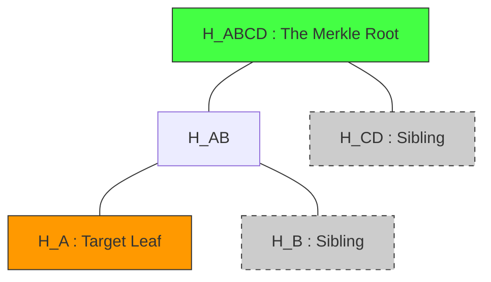

# Execution Certificate Framework v2

The Execution Certificate Framework v2 separates **cryptographic proof** of execution from **constitutional legitimacy**. A certificate is an immutable cryptographic bundle proving that a specific workload ran, produced a specific state, and exists within the canonical evidence chain. It makes absolutely no claims about whether the execution was authorized by policy.

## 1. What a Certificate Proves and Does NOT Prove

### 1.1 What a Certificate Proves (True Assertions)
An Execution Certificate v2 provides non-repudiable cryptographic proof that:
- **Execution existed**: A specific computation took place, resulting in a known `execution_hash`.
- **Lineage existed**: The execution was deterministically sequenced after a known `previous_execution_hash`, anchoring it in a historical timeline.
- **Evidence chain existed**: The execution record is permanently recorded within the Evidence Ledger (via Merkle inclusion).
- **Replay reference existed**: Enough deterministic inputs/state pointers exist to theoretically reproduce the workload.

### 1.2 What a Certificate Does NOT Prove (False Assumptions)
An Execution Certificate v2 **MUST NOT** be used to assert:
- **Execution was authorized**: A producer may have executed a workload they lacked permissions for (Rogue computation). The certificate proves they *did* it, not that they were *allowed* to do it.
- **Execution was correct**: The certificate guarantees the generated state, but doesn't guarantee the application logic executing it lacked bugs or Byzantine behavior. (That requires Replay).
- **Execution was legitimate**: The execution may violate systemic ecosystem limits/quotas.
- **Execution was constitutionally approved**: The GC (Governance/Constitutional) boundary may later evaluate and reject the state change, even though a valid certificate exists.

## 2. Portable Verification Bundle

The certificate is designed to be highly portable. Ecosystem nodes can download the bundle and independently verify cryptographic truth without connecting to a live API.

### 2.1 Bundle Directory Structure

```text
certificate_<hash>/
├── execution_record.json      # Raw JSON of the ExecutionRecord
├── lineage_record.json        # Previous sequencing and sequence identifier
├── merkle_proof.json          # Sibling path, root hash, and inclusion logic constraints
├── certificate_metadata.json  # Issuer identity, timestamps, versioning
└── verification_manifest.json # Instructions and expected checksums for verification
```

### 2.2 Verification Flow

When a node receives the Portable Verification Bundle:
1. **Hash Verification**: Compute `execution_hash` from `execution_record.json`. Compare against the provided hash field.
2. **Lineage Verification**: Calculate the linkage between the bundle's `execution_hash` and the supplied `previous_execution_hash`.
3. **Chain Existence**: Follow the Merkle Inclusion Proof (inside `merkle_proof.json`) using the base hash and sibling hashes to independently derive the Merkle Root.
4. **Compare Root**: Check the derived root against the widely published Canon Evidence Ledger Merkle Root for the sequence epoch.
*(Notice: None of these steps involve calling a policy engine or checking authorization).*

## 3. Merkle Inclusion Proof Design

To prove that `execution_record` belongs to the ledger without shipping the entire database, the certificate includes a cryptographic pathway from the leaf node up to the tree root.

### 3.1 Extended Certificate Model (Merkle Design)

The `merkle_proof.json` contains:
- `leaf_hash`: Re-computed evidence base hash.
- `sibling_hashes`: An ordered list of sibling hashes (left/right modifiers) required to compute up the tree hierarchy.
- `root_hash`: The target canonical root.
- `leaf_index`: The sequence number or spatial index to determine left/right concatenation order during traversal.

### 3.2 Root Validation Procedure (Worked Example)

Assume we are proving existence of execution hash `H_A`.

**Proof Requirements**:
- `leaf_hash` = `H_A`
- `sibling_hashes` = `[H_B, H_CD]`
- `index_path` = `[0, 0]` (0 = left, 1 = right; represents position of sibling)
- `expected_root` = `H_ABCD`

**Verification Steps (Client Side)**:
1. **Level 0**: Start with `current_hash = H_A`.
2. **Level 1**: Look at `index_path[0] == 0`. The sibling `H_B` is on the right.
   - Result: `current_hash = hash(H_A + H_B) = H_AB`
3. **Level 2**: Look at `index_path[1] == 0`. The sibling `H_CD` is on the right.
   - Result: `current_hash = hash(H_AB + H_CD) = H_ABCD`
4. **Validation Conclusion**: `H_ABCD == expected_root`. The verification is SUCCESSFUL.


The graph demonstrates the hashes provided in the certificate bundle (dotted) to rebuild the Root (green) starting from the Target Leaf (orange).
