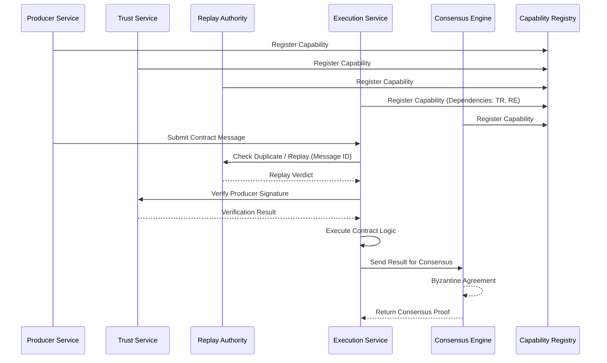

# Service Interaction Diagram

The following diagram illustrates the interaction between the distributed QCG runtime services during a typical execution cycle.

```mermaid
sequenceDiagram
    participant PR as Producer Service
    participant TR as Trust Service
    participant RE as Replay Authority
    participant EX as Execution Service
    participant CO as Consensus Engine
    participant RG as Capability Registry

    PR->>RG: Register Capability
    TR->>RG: Register Capability
    RE->>RG: Register Capability
    EX->>RG: Register Capability (Dependencies: TR, RE)
    CO->>RG: Register Capability

    PR->>EX: Submit Contract Message
    EX->>RE: Check Duplicate / Replay (Message ID)
    RE-->>EX: Replay Verdict
    EX->>TR: Verify Producer Signature
    TR-->>EX: Verification Result
    EX->>EX: Execute Contract Logic
    EX->>CO: Send Result for Consensus
    CO-->>CO: Byzantine Agreement
    CO-->>EX: Return Consensus Proof
```
