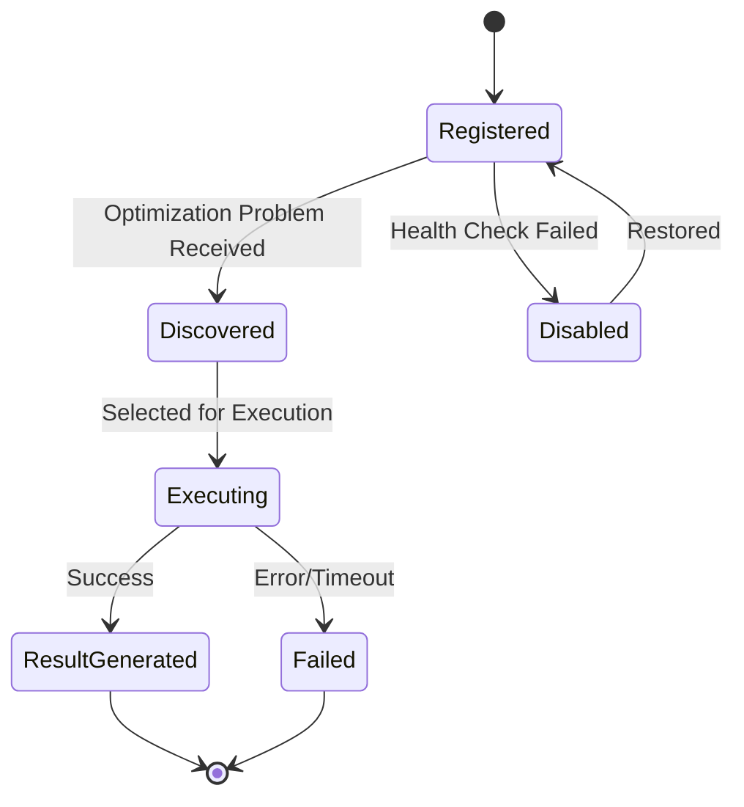
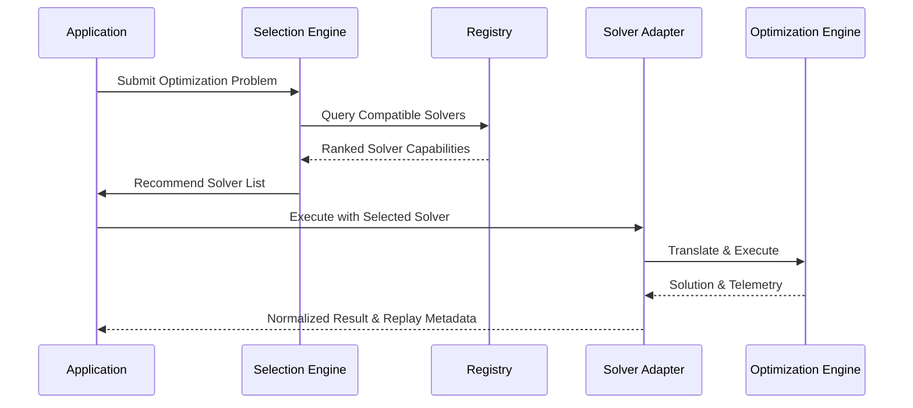

# Universal Solver Fabric

## 1. Overview
The Universal Solver Fabric is the foundational optimization infrastructure of the BHIV Sovereign Optimization Capability under TANTRA Phase V. It serves as an agnostic execution layer allowing optimization technologies (classical, quantum, heuristic, evolutionary) to participate within the BHIV ecosystem through governed capability contracts. As defined by the BCAB/BCAES canonical model, it is deployed as a **Platform Service Capability** (`Optimization.SolverFabric.v1`), strictly decoupling domain formulation from deterministic execution.

## 2. Solver Lifecycle

The lifecycle of any optimization solver within the fabric consists of the following states:
1. **Registration**: The solver registers its capabilities via the unified Solver Capability Contract.
2. **Discovery**: Solvers are discovered and ranked by the Solver Selection Engine based on incoming optimization problems.
3. **Execution**: The chosen solver is attached to the problem via its attachment interface, executing deterministically.
4. **Result Generation**: Outputs are captured with provenance, confidence scores, and replay metadata.
5. **Deregistration/Disabling**: Solvers can be disabled or removed if they fail health checks or authority boundaries are updated.

## 3. Registration Flow
1. Solvers declare themselves to the **Universal Solver Registry** using a JSON schema conforming to `solver_contract.schema.json`.
2. The Registry validates the schema, verifies compatibility, and persists the registration metadata.
3. Solvers broadcast their health status and update capability metadata dynamically (e.g., changes in supported constraints or objective functions).

## 4. Capability Contracts
Every solver must strictly adhere to the Universal Capability Contract. The contract is schema-driven and guarantees the fabric understands:
- What problems the solver can handle (e.g., MIP, QUBO).
- Whether execution is deterministic and replay-safe.
- Estimated resource requirements and cost models.
- Authority limits defining the boundaries of operation.

## 5. Execution Lifecycle
The execution process decouples the orchestration from the algorithm:
1. **Request**: Problem mapped into an agnostic schema.
2. **Select**: Selection Engine determines the best solver.
3. **Bind**: Fabric binds the problem to the solver's specific adapter (e.g., Pyomo for MILP, Qiskit for QUBO).
4. **Solve**: The solver executes asynchronously.
5. **Observe**: Insights and telemetry are captured without altering execution flow.

## 6. Result Lifecycle
The result output is strictly typed and must contain:
- Solution state (decision variables, objective value).
- Convergence status (Optimal, Feasible, Infeasible, Unbounded).
- Execution artifacts (logs, resource usage).
- Replay metadata enabling exact reproduction of the result.
- A confidence score.

## 7. Failure Lifecycle
Solvers must fail gracefully and deterministically. The failure lifecycle handles:
- **Capability Mismatch**: Problem rejected before execution.
- **Time/Resource Limits**: Execution aborted, partial results reported if available.
- **Engine Crash**: Adapter catches exceptions, translating them to standard error codes.
The Selection Engine will update confidence in a solver upon repeated failures.

## 8. Version Negotiation & Compatibility Model
- **Schema Versioning**: Capabilities contain `schema_version`. Backward compatibility is enforced.
- **Compatibility Matrix**: The Registry evaluates a problem's requirements against solvers. If a problem needs `explainability_support = true`, solvers without this capability are filtered out.
- **Attachment Modes**: Solvers can run in `local`, `remote`, or `hybrid` attachment modes, negotiated during the binding phase.
