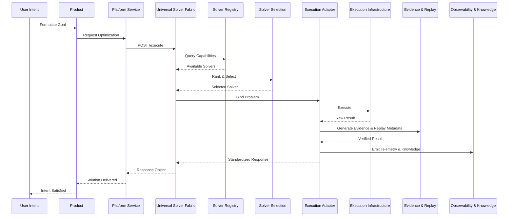

# Runtime Flow: Universal Solver Fabric

This document details the canonical runtime path for executing an optimization request through the Universal Solver Fabric, deployed as a Platform Service within the TANTRA ecosystem.

## Canonical Runtime Path

The execution flow enforces strict separation between domain logic and execution logic. The fabric remains a participant, not an orchestrator.

The required execution path is:
1. **User Intent**: The user's goal is formulated.
2. **Product**: The product layer captures the intent and forms a request.
3. **Platform Service**: The request hits the `Optimization.SolverFabric.v1` endpoint.
4. **Universal Solver Fabric**: The fabric receives the request and coordinates the solver lifecycle.
5. **Solver Registry**: The fabric queries the registry for registered capabilities.
6. **Solver Selection**: The selection engine deterministically ranks and selects the best solver.
7. **Execution Adapter**: The selected solver's adapter binds the agnostic problem to a specific format.
8. **Execution Infrastructure**: The underlying execution engine runs the optimization.
9. **Evidence**: Replay-safe cryptographic and deterministic evidence is generated.
10. **Replay**: Replay IDs and metadata are attached for future reproduction.
11. **Observability**: Telemetry and execution traces are emitted.
12. **Knowledge**: The execution context is made available for future executions and learning.

## Sequence Diagram

